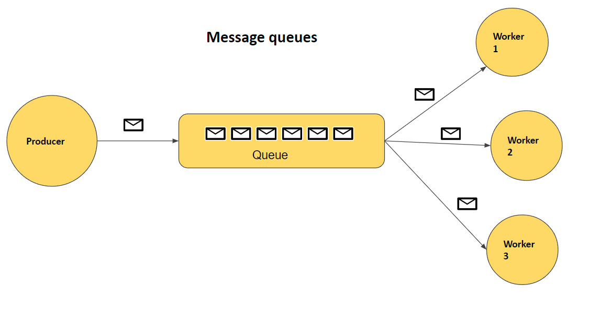
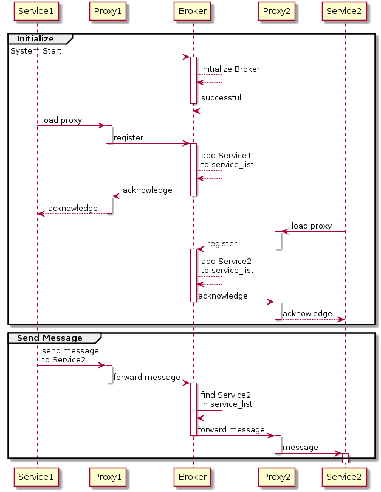

# Message Queue

Message queues and mailboxes are software-engineering components typically used for `inter-process communication (IPC)`, or for `inter-thread communication` within the same process.

Message queues allow the exchange of information between distributed applications. A message queue can reside in memory or disk storage. Messages stay in the queue until the time they are processed by a service consumer. Through the message queue, the application can be implemented independently - they do not need to know each other's position, or continue to implement procedures to remove the need for waiting to receive this message.

They use a queue for messaging – the passing of control or of content. Group communication systems provide similar kinds of functionality. 

The message queue paradigm is a sibling of the `publisher/subscriber` pattern, and is typically one part of a larger message-oriented middleware system. Most messaging systems support both the `publisher/subscriber` and `message queue models` in their API, e.g. `Java Message Service (JMS)`.

Competing Consumers pattern enables multiple concurrent consumers to process messages on the same message queue.

Message queues implement an asynchronous communication pattern between two or more processes/threads whereby the sending and receiving party do not need to interact with the message queue at the same time. Messages placed onto the queue are stored until the recipient retrieves them. Message queues have implicit or explicit limits on the size of data that may be transmitted in a single message and the number of messages that may remain outstanding on the queue.

### Remit Vs Ownership

- `Remit`

Many implementations of message queues function internally within an operating system or within an application. Such queues exist for the purposes of that system only.

Other implementations allow the passing of messages between different computer systems, potentially connecting multiple applications and multiple operating systems. 

These message queuing systems typically provide resilience functionality to ensure that messages do not get "lost" in the event of a system failure. Examples of commercial implementations of this kind of message queuing software (also known as message-oriented middleware) include `IBM MQ`(formerly MQ Series) and `Oracle Advanced Queuing` (AQ). There is a Java standard called Java Message Service, which has several proprietary and free software implementations. 

`Real-time operating systems (RTOSes)` such as `VxWorks` and `QNX` encourage the use of message queuing as the primary inter-process or inter-thread communication mechanism. 

This can result in integration between message passing and CPU scheduling. Early examples of commercial RTOSes that encouraged a message-queue basis to inter-thread communication also include VRTX and pSOS+, both of which date to the early 1980s. 

`The Erlang programming language uses processes to provide concurrency; these processes communicate asynchronously using message queuing. `

- `Ownership`

The message queue software can be either proprietary, open source or a mix of both. It is then run either on premise in private servers or on external cloud servers (message queuing service). 

`Proprietary` options have the longest history, and include products from the inception of message queuing, such as `IBM MQ`, and those tied to specific operating systems, such as `Microsoft Message Queuing (MSMQ)`. Cloud service providers also provide their proprietary solutions such as `Amazon Simple Queue Service (SQS)`, `StormMQ`, `Solace`, and `IBM MQ`.

`Open source` choices of messaging middleware systems includes `Apache ActiveMQ`, `Apache Kafka`, `Apache Qpid`, `Apache RocketMQ`, `Enduro/X`, J`Boss Messaging`, `JORAM`, `RabbitMQ`, `Sun Open Message Queue`, and `Tarantool`.  

Examples on hardware-based messaging middleware vendors are `Solace`, `Apigee`, and `IBM MQ`. 

### Usages of Message Queue

In a typical message-queueing implementation, a system administrator installs and configures message-queueing software (a queue manager or `broker`), and defines a named message queue. Or they register with a message queuing service. 

An application then registers a software routine that "listens" for messages placed onto the queue. 

Second and subsequent applications may connect to the queue and transfer a message onto it. 

The queue-manager software stores the messages until a receiving application connects and then calls the registered software routine. The receiving application then processes the message in an appropriate manner. 

There are often numerous options as to the exact semantics of message passing, including: 

- `Durability` –> messages may be kept in memory, written to disk, or even committed to a DBMS if the need for reliability indicates a more resource-intensive solution.

- `Security policies` –> which applications should have access to these messages?

- `Message purging policies` –> queues or messages may have a "time to live".

- `Message filtering` –> some systems support filtering data so that a subscriber may only see messages matching some pre-specified criteria of interest.

- `Delivery policies` –> do we need to guarantee that a message is delivered at least once, or no more than once?

- `Routing policies` –> in a system with many queue servers, what servers should receive a message or a queue's messages?

- `Batching policies` –> should messages be delivered immediately? Or should the system wait a bit and try to deliver many messages at once?

- `Queuing criteria` –> when should a message be considered "enqueued"? When one queue has it? Or when it has been forwarded to at least one remote queue? Or to all queues?

- `Receipt notification` –> A publisher may need to know when some or all subscribers have received a message.

These are all considerations that can have substantial effects on transaction semantics, system reliability, and system efficiency. 

### Message Queue Protocols

Historically, message queuing has used `proprietary`, `closed protocols`, restricting the ability for different operating systems or programming languages `to interact in a heterogeneous set of environments`. 

An early attempt to make message queuing more ubiquitous was `Sun Microsystems' JMS` specification, which provided a Java-only abstraction of a client API. This allowed Java developers to switch between providers of message queuing in a fashion similar to that of developers using SQL databases. In practice, given the diversity of message queuing techniques and scenarios, this wasn't always as practical as it could be. 

Three standards have emerged which are used in open source message queue implementations: 

    
- `Advanced Message Queuing Protocol (AMQP)` –> feature-rich message queue protocol, approved as ISO/IEC 19464 since April 2014

- `Streaming Text Oriented Messaging Protocol (STOMP)` –> simple, text-oriented message protocol
    
- `MQTT (formerly MQ Telemetry Transport) `–> lightweight message queue protocol especially for embedded devices

These protocols are at different stages of standardization and adoption. The first two operate at the same level as `HTTP`, `MQTT` at the level of `TCP/IP`. 

Some proprietary implementations also use `HTTP` to provide message queuing by some implementations, such as `Amazon's SQS`. 

This is because it is always possible to layer `asynchronous behaviour` (which is what is required for message queuing) over a synchronous protocol using request-response semantics. However, such implementations are constrained by the underlying protocol in this case and may not be able to offer the full fidelity or set of options required in message passing above. 

### Behaviour of Message Queue

Many of the more widely known communications protocols in use operate synchronously. The HTTP protocol – used in the World Wide Web and in web services – offers an obvious example where a user sends a request for a web page and then waits for a reply. 

However, scenarios exist in which synchronous behaviour is not appropriate. 

For example, AJAX (Asynchronous JavaScript and XML) can be used to asynchronously send text, JSON or XML messages to update part of a web page with more relevant information. Google uses this approach for their Google Suggest, a search feature which sends the user's partially typed queries to Google's servers and returns a list of possible full queries the user might be interested in the process of typing. This list is asynchronously updated as the user types. 

Other asynchronous examples exist in event notification systems and publish/subscribe systems. 

- An application may need to notify another that an event has occurred, but does not need to wait for a response.
    
- In publish/subscribe systems, an application "publishes" information for any number of clients to read.

In both of the above examples it would not make sense for the sender of the information to have to wait if, for example, one of the recipients had crashed. 

Applications need not be exclusively synchronous or asynchronous. 

An interactive application may need to respond to certain parts of a request immediately (such as telling a customer that a sales request has been accepted, and handling the promise to draw on inventory), but may queue other parts (such as completing calculation of billing, forwarding data to the central accounting system, and calling on all sorts of other services) to be done some time later. 

In all these sorts of situations, having a subsystem which performs message-queuing (or alternatively, a broadcast messaging system) can help improve the behavior of the overall system. 

## Message Oriented Middleware

Message-oriented middleware (MOM) is software or hardware infrastructure supporting sending and receiving messages between distributed systems.

MOM allows application modules to be distributed over `heterogeneous platforms` and reduces the complexity of developing applications that span multiple operating systems and network protocols. 

The `middleware` creates a distributed communications layer that insulates the application developer from the details of the various operating systems and network interfaces.

Application programming interfaces (APIs) that extend across diverse platforms and networks are typically provided by MOM.

This middleware layer allows software components (applications, Jakarta Enterprise Beans, servlets, and other components) that have been developed independently and that run on different networked platforms to interact with one another. Applications distributed on different network nodes use the application interface to communicate. 

In addition, by providing an administrative interface, this new, virtual system of interconnected applications can be made fault tolerant and secure.

MOM provides software elements that reside in all communicating components of a client/server architecture and typically support asynchronous calls between the client and server applications. MOM reduces the involvement of application developers with the complexity of the master-slave nature of the client/server mechanism. 

### Middleware Categories 

There are three middleware categories exists in message queue systems

- Remote procedure call or `RPC-based middleware`
- Object request broker or `ORB-based middleware`
- Message-oriented middleware or `MOM-based middleware`

All these models make it possible for one software component to affect the behavior of another component over a network. They are different in that RPC- and ORB-based middleware create systems of tightly coupled components, whereas MOM-based systems allow for a loose coupling of components. In an RPC- or ORB-based system, when one procedure calls another, it must wait for the called procedure to return before it can do anything else. In these synchronous messaging models, the middleware functions partly as a super-linker, locating the called procedure on a network and using network services to pass function or method parameters to the procedure and then to return results.

## Advantages of using Message-oriented Middleware Systems 

Central reasons for using a message-based communications protocol include its ability to store (buffer), route, or transform messages while conveying them from senders to receivers. 

Another advantage of messaging provider mediated messaging between clients is that by adding an administrative interface, you can monitor and tune performance. Client applications are thus effectively relieved of every problem except that of sending, receiving, and processing messages. It is up to the code that implements the MOM system and up to the administrator to resolve issues like interoperability, reliability, security, scalability, and performance. 

- `Asynchronicity` ---> Using a MOM system, a client makes an API call to send a message to a destination managed by the provider. The call invokes provider services to route and deliver the message. Once it has sent the message, the client can continue to do other work, confident that the provider retains the message until a receiving client retrieves it. The message-based model, coupled with the mediation of the provider, makes it possible to create a system of loosely coupled components. 

MOM comprises a category of inter-application communication software that generally relies on asynchronous message-passing, as opposed to a request-response architecture. In asynchronous systems, message queues provide temporary storage when the destination program is busy or not connected. In addition, most asynchronous MOM systems provide persistent storage to back up the message queue. This means that the sender and receiver do not need to connect to the network at the same time (asynchronous delivery), and problems with intermittent connectivity are solved. It also means that should the receiver application fail for any reason, the senders can continue unaffected, as the messages they send will simply accumulate in the message queue for later processing when the receiver restarts. 

- `Routing` ---> Many message-oriented middleware implementations depend on a message queue system. Some implementations permit routing logic to be provided by the messaging layer itself, while others depend on client applications to provide routing information or allow for a mix of both paradigms. Some implementations make use of broadcast or multicast distribution paradigms. 

- `Transformation` ---> In a message-based middleware system, the message received at the destination need not be identical to the message originally sent. A MOM system with built-in intelligence can transform messages and route to match the requirements of the sender or of the recipient. In conjunction with the routing and broadcast/multicast facilities, one application can send a message in its own native format, and two or more other applications may each receive a copy of the message in their own native format. Many modern MOM systems provide sophisticated message transformation (or mapping) tools which allow programmers to specify transformation rules applicable to a simple GUI drag-and-drop operation. 

## Disadvantages of using Message-oriented Middleware Systems 

The primary disadvantage of many message-oriented middleware systems is that they require an extra component in the architecture, the message transfer agent (message broker). As with any system, adding another component can lead to reductions in performance and reliability, and can also make the system as a whole more difficult and expensive to maintain. 

In addition, many inter-application communications have an intrinsically synchronous aspect, with the sender specifically wanting to wait for a reply to a message before continuing (see real-time computing and near-real-time for extreme cases). Because message-based communication inherently functions asynchronously, it may not fit well in such situations. That said, most MOM systems have facilities to group a request and a response as a single pseudo-synchronous transaction. 

With a synchronous messaging system, the calling function does not return until the called function has finished its task. In a loosely coupled asynchronous system, the calling client can continue to load work upon the recipient until the resources needed to handle this work are depleted and the called component fails. Of course, these conditions can be minimized or avoided by monitoring performance and adjusting message flow, but this is work that is not needed with a synchronous messaging system. The important thing is to understand the advantages and liabilities of each kind of system. Each system is appropriate for different kinds of tasks. Sometimes, a combination of the two kinds of systems is required to obtain the desired behavior. 

## Advanced Message Queuing Protocol (AMQP)

The Advanced Message Queuing Protocol (AMQP) is an `open standard binary application layer protocol` for `message-oriented middleware`.

It is an OSI application layer (Layer 7) protocol.

The defining features of AMQP are message orientation, queuing, routing (including point-to-point and publish-and-subscribe), reliability and security.

It is designed to efficiently support a wide variety of messaging applications and communication patterns. It provides flow controlled,message-oriented communication with message-delivery guarantees such as at-most-once (where each message is delivered once or never), at-least-once (where each message is certain to be delivered, but may do so multiple times) and exactly-once (where the message will always certainly arrive and do so only once),and authentication and/or encryption based on SASL and/or TLS.It assumes an underlying reliable transport layer protocol such as Transmission Control Protocol (TCP).

The AMQP specification is defined in several layers: (i) a type system, (ii) a symmetric, asynchronous protocol for the transfer of messages from one process to another, (iii) a standard, extensible message format and (iv) a set of standardised but extensible 'messaging capabilities.' 

AMQP mandates the behavior of the messaging provider and client to the extent that implementations from different vendors are interoperable, in the same way as `SMTP`, `HTTP`, `FTP`, etc. have created interoperable systems.

Previous standardizations of middleware have happened at the API level (e.g. JMS) and were focused on standardizing programmer interaction with different middleware implementations, rather than on providing interoperability between multiple implementations. Unlike JMS, which defines an API and a set of behaviors that a messaging implementation must provide, AMQP is a wire-level protocol. 

A wire-level protocol is a description of the format of the data that is sent across the network as a stream of bytes. Consequently, any tool that can create and interpret messages that conform to this data format can interoperate with any other compliant tool irrespective of implementation language. 

### History of AMQP

AMQP was originated in 2003 by `John O'Hara` at `JPMorgan Chase` in London. AMQP was conceived as a co-operative open effort. The initial design was by JPMorgan Chase from mid-2004 to mid-2006 and it contracted iMatix Corporation to develop a C broker and protocol documentation. 

In 2005 JPMorgan Chase approached other firms to form a working group that included Cisco Systems, IONA Technologies, iMatix, Red Hat, and Transaction Workflow Innovation Standards Team (TWIST). In the same year JPMorgan Chase partnered with Red Hat to create Apache Qpid, initially in Java and soon after C++. Independently, 

RabbitMQ was developed in Erlang by Rabbit Technologies, followed later by the Microsoft and StormMQ implementations. 

The working group grew to 23 companies including Bank of America, Barclays, Cisco Systems, Credit Suisse, Deutsche Börse, Goldman Sachs, HCL Technologies Ltd, Progress Software, IIT Software, INETCO Systems Limited, Informatica (including 29 West), JPMorgan Chase, Microsoft Corporation, my-Channels, Novell, Red Hat, Software AG, Solace Systems, StormMQ, Tervela Inc., TWIST Process Innovations ltd, VMware (which acquired Rabbit Technologies) and WSO2. 

In 2008, Pieter Hintjens, CEO and chief software designer of iMatix, wrote an article called "What is wrong with AMQP (and how to fix it)" and distributed it to the working group to alert of imminent failure, identify problems seen by iMatix and propose ways to fix the AMQP specification. By then, iMatix had already started work on ZeroMQ. In 2010, Hintjens announced that iMatix would leave the AMQP workgroup and did not plan to support AMQP/1.0 in favor of the significantly simpler and faster ZeroMQ.

In August 2011, the AMQP working group announced its reorganization into an OASIS member section.

AMQP 1.0 was released by the AMQP working group on 30 October 2011, at a conference in New York. At the event Microsoft, Red Hat, VMware, Apache, INETCO and IIT Software demonstrated software running the protocol in an interoperability demonstration. The next day, on 1 November 2011, the formation of an OASIS Technical Committee was announced to advance this contributed AMQP version 1.0 through the international open standards process. The first draft from OASIS was released in February 2012, the changes as compared to that published by the Working Group being restricted to edits for improved clarity (no functional changes). The second draft was released for public review on 20 June (again with no functional changes), and AMQP was approved as an OASIS standard on 31 October 2012.

OASIS AMQP was approved for release as an ISO and IEC International Standard in April 2014. AMQP 1.0 was balloted through the Joint Technical Committee on Information Technology (JTC1) of the International Standards Organization (ISO) and the International Electrotechnical Commission (IEC). The approved OASIS AMQP submission has been given the designation, ISO/IEC 19464. 

Previous versions of AMQP were 0-8, published in June 2006, 0-9, published in December 2006, 0-10 published in February 2008 and 0-9-1, published in November 2008. These earlier releases are significantly different from the 1.0 specification.

Whilst AMQP originated in the financial services industry, it has general applicability to a broad range of middleware problems. 

### Description of AMQP 1.0

- `Type system`

AMQP defines a self-describing encoding scheme allowing interoperable representation of a wide range of commonly used types. It also allows typed data to be annotated with additional meaning, for example a particular string value might be annotated so that it could be understood as a URL. Likewise a map value containing key-value pairs for 'name', 'address' etc., might be annotated as being a representation of a 'customer' type. 

The type-system is used to define a message format allowing standard and extended meta-data to be expressed and understood by processing entities. It is also used to define the communication primitives through which messages are exchanged between such entities, i.e. the AMQP frame bodies.

- `Performatives and the link protocol`

The basic unit of data in AMQP is a frame. There are nine AMQP frame bodies defined that are used to initiate, control and tear down the transfer of messages between two peers. These are :::

- open (the connection)
- begin (the session)
- attach (the link)
- transfer
- flow
- disposition
- detach (the link)
- end (the session)
- close (the connection)

The link protocol is at the heart of AMQP. 

An attach frame body is sent to initiate a new link; a detach to tear down a link. Links may be established in order to receive or send messages.

Messages are sent over an established link using the transfer frame. Messages on a link flow in only one direction.

Transfers are subject to a credit-based flow control scheme, managed using flow frames. This allows a process to protect itself from being overwhelmed by too large a volume of messages or more simply to allow a subscribing link to pull messages as and when desired.

Each transferred message must eventually be settled. Settlement ensures that the sender and receiver agree on the state of the transfer, providing reliability guarantees. Changes in state and settlement for a transfer (or set of transfers) are communicated between the peers using the disposition frame. Various reliability guarantees can be enforced this way: at-most-once, at-least-once and exactly-once.

Multiple links, in both directions, can be grouped together in a session. A session is a bidirectional, sequential conversation between two peers that is initiated with a begin frame and terminated with an end frame. A connection between two peers can have multiple sessions multiplexed over it, each logically independent. Connections are initiated with an open frame in which the sending peer's capabilities are expressed, and terminated with a close frame. 

- `Message format`

AMQP defines as the bare message, that part of the message that is created by the sending application. This is considered immutable as the message is transferred between one or more processes. 

Ensuring the message as sent by the application is immutable allows for end-to-end message signing and/or encryption and ensures that any integrity checks (e.g. hashes or digests) remain valid. The message can be annotated by intermediaries during transit, but any such annotations are kept distinct from the immutable bare message. Annotations may be added before or after the bare message.

The header is a standard set of delivery-related annotations that can be requested or indicated for a message and includes time to live, durability, priority.

The bare message itself is structured as an optional list of standard properties (message id, user id, creation time, reply to, subject, correlation id, group id etc.), an optional list of application-specific properties (i.e., extended properties) and a body, which AMQP refers to as application data.

Properties are specified in the AMQP type system, as are annotations. The application data can be of any form, and in any encoding the application chooses. One option is to use the AMQP type system to send structured, self-describing data. 

- `Messaging capabilities`

The link protocol transfers messages between two nodes but assumes very little as to what those nodes are or how they are implemented. 

A key category is those nodes used as a rendezvous point between senders and receivers of messages (e.g. queues or topics). The AMQP specification calls such nodes distribution nodes and codifies some common behaviors.

This includes:

- - some standard outcomes for transfers, through which receivers of messages can for example accept or reject messages

- - a mechanism for indicating or requesting one of the two basic distribution patterns, competing- and non-competing- consumers, through the distribution modes move and copy respectively

- - the ability to create nodes on-demand, e.g. for temporary response queues

- - the ability to refine the set of message of interest to a receiver through filters 

Though AMQP can be used in simple peer-to-peer systems, defining this framework for messaging capabilities additionally enables interoperability with messaging intermediaries (brokers, bridges etc.) in larger, richer messaging networks. The framework specified covers basic behaviors but allows for extensions to evolve that can be further codified and standardised. 

### Implementations of AMQP

- `AMQP 1.0 broker implementations`

- - Apache Qpid, an open-source project at the Apache Foundation
- - Apache ActiveMQ, an open-source project at the Apache Foundation
- - Azure Event Hubs
- - Azure Service Bus
- - IBM MQ
- - Solace PubSub+, a multi-protocol broker in hardware, software, and cloud

- `Pre-1.0 AMQP broker implementations`

- - JORAM, a Java open-source implementation from the OW2 Consortium.
- - Apache Qpid maintains support for multiple AMQP versions
- - RabbitMQ, an open-source project sponsored by VMware, primarily supports AMQP 0-9-1, with 1.0 via a plugin

### Specification of AMQP

AMQP protocol version 1.0 is the current specification version. It focuses on core features which are necessary for interoperability at Internet scale. It contains less explicit routing than previous versions because core functionality is the first to be rigorously standardized. AMQP 1.0 interoperability has been more extensively tested with more implementors than prior versions.

The AMQP website contains the OASIS specification for version 1.0. 

Earlier versions of AMQP, published prior to the release of 1.0 (see History above) and significantly different from it, include: 

AMQP 0-9-1 (which has clients available "for many popular programming languages and platforms")

https://www.amqp.org/specification/0-9-1/amqp-org-download

AMQP 0-10

https://www.amqp.org/specification/0-10/amqp-org-download

- `Comparable specifications`

These open protocol specifications cover the same or a similar space as AMQP: 

- - Streaming Text Oriented Messaging Protocol (STOMP), a text-based protocol developed at Codehaus; uses the JMS-like semantics of 'destination'.
    
- - Extensible Messaging and Presence Protocol (XMPP), the Extensible Messaging and Presence Protocol.
    MQTT, a lightweight publish-subscribe protocol.

- - OpenWire as used by ActiveMQ.

Java Message Service (JMS), is often compared to AMQP. However, JMS is an API specification (part of the Java EE specification) that defines how message producers and consumers are implemented. JMS does not guarantee interoperability between implementations, and the JMS-compliant messaging system in use may need to be deployed on both client and server. On the other hand, AMQP is a wire-level protocol specification. In theory AMQP provides interoperability as different AMQP-compliant software can be deployed on the client and server sides. 

## Message Broker

A message broker (also known as an `integration broker` or `interface engine`) is an intermediary computer program module that translates a message from the formal messaging protocol of the sender to the formal messaging protocol of the receiver. 

Message brokers are elements in telecommunication or computer networks where software applications communicate by exchanging formally-defined messages.

Message brokers are a building block of `message-oriented middleware (MOM)` but are typically not a replacement for traditional middleware like MOM and remote procedure call (RPC).

So, A message broker is an architectural pattern for message validation, transformation, and routing. It mediates communication among applications, minimizing the mutual awareness that applications should have of each other in order to be able to exchange messages, effectively implementing decoupling.

### Purpose of Message Broker

The primary purpose of a broker is to take incoming messages from applications and perform some action on them. Message brokers can decouple end-points, meet specific non-functional requirements, and facilitate reuse of intermediary functions. For example, a message broker may be used to manage a workload queue or message queue for multiple receivers, providing reliable storage, guaranteed message delivery and perhaps transaction management. 

### Life cycle of Message Broker

The following represent other examples of actions that might be handled by the broker :::

- Route messages to one or more destinations
    
- Transform messages to an alternative representation
    
- Perform message aggregation, decomposing messages into multiple messages and sending them to their destination, then recomposing the responses into one message to return to the user
    
- Interact with an external repository to augment a message or store it
    
- Invoke web services to retrieve data
    
- Respond to events or errors
    
- Provide content and topic-based message routing using the `publish–subscribe pattern`

Message brokers are generally based on one of two fundamental architectures: `hub-and-spoke` and `message bus`. 

In the first, a central server acts as the mechanism that provides integration services, whereas with the latter, the message broker is a communication backbone or distributed service that acts on the bus. Additionally, a more scalable multi-hub approach can be used to integrate multiple brokers.

# List of Message Broker Softwares

- IBM MQ
- Apache Kafka
- RabbitMQ (Mozilla Public License, written in Erlang)
- Redpanda (implement Apache Kafka api, written in C++)
- Google Cloud Pub/Sub (Google)
- Amazon Web Services (AWS) Amazon MQ
- Amazon Web Services (AWS) Kinesis
- Microsoft Azure Service Bus (Microsoft)
- Microsoft BizTalk Server (Microsoft)

and many more exist out there...

